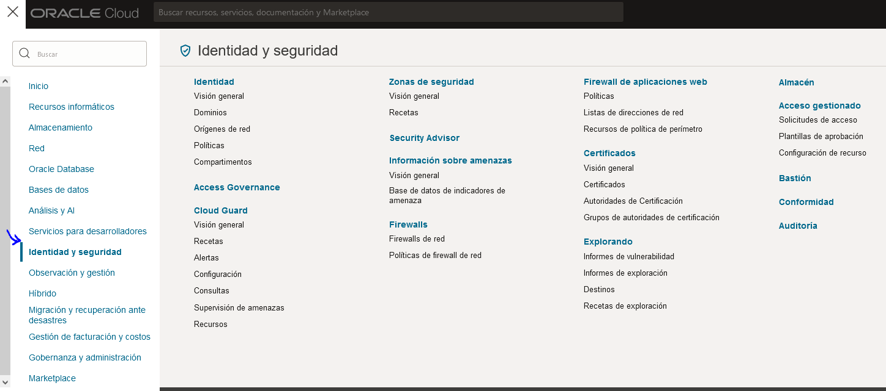

## Configurando conexion con Workbench

1. Crear una politica en identity & security
2. Se agregan las politicas manualmente





```bash
    Allow group Administrators to {COMPARTMENT_INSPECT} in tenancy
    Allow group Administrators to {VCN_READ, SUBNET_READ,
    SUBNET_ATTACH, SUBNET_DETACH} in tenancy
    Allow group Administrators to manage mysql-family in tenancy
```

